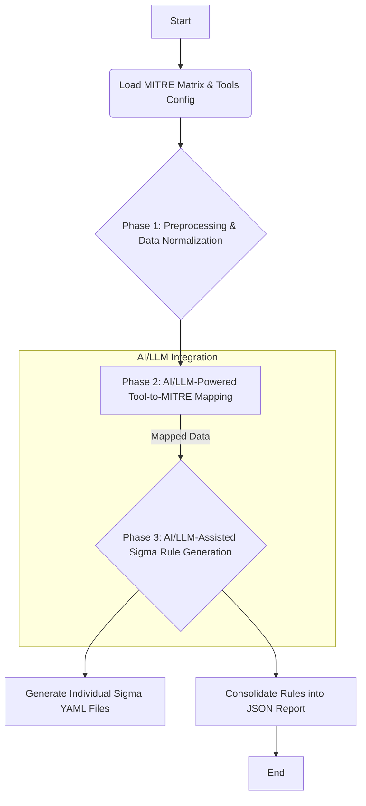

# AIMitreGen: AI-Powered MITRE ATT&CK to Sigma Rule Generator

---

## Table of Contents

1. [Introduction](#1-introduction)
2. [Key Features](#2-key-features)
3. [AI/LLM Integration: The Core Workflow](#3-aillm-integration-the-core-workflow)
   * [AI&#39;s Role in Mapping &amp; Rule Generation](#ai-s-role-in-mapping--rule-generation)
   * [Conceptual Workflow Diagram](#conceptual-workflow-diagram)
   * [Prompting Strategy &amp; Iteration](#prompting-strategy--iteration)
   * [Current Capabilities &amp; Future Vision](#current-capabilities--future-vision)
4. [Project Structure](#4-project-structure)
5. [Getting Started](#5-getting-started)
   * [Prerequisites](#prerequisites)
   * [Installation](#installation)
   * [Configuration](#configuration)
   * [Usage](#usage)
6. [Output](#6-output)
7. [Contributing](#7-contributing)
8. [License](#8-license)
9. [Acknowledgements](#9-acknowledgements)
10. [Contact](#10-contact)

---

## 1. Introduction

AIMitreGen is an innovative project designed to automate and enhance the creation of security detection rules by leveraging the power of Artificial Intelligence (AI) and Large Language Models (LLMs). It automates the complex process of mapping threat intelligence (specifically MITRE ATT&CK techniques) to relevant security tools and subsequently generating actionable Sigma rules for various SIEM platforms.

The primary goal of AIMitreGen is to reduce the manual effort involved in developing high-fidelity detection content, accelerate threat detection engineering, and ensure comprehensive coverage against adversary tactics and techniques defined by the MITRE ATT&CK framework.

## 2. Key Features

* **AI/LLM-Powered Mapping:** Utilizes advanced LLMs to intelligently map security tools' capabilities and data sources to specific MITRE ATT&CK techniques.
* **Automated Sigma Rule Generation:** Creates detection logic in the universal [Sigma format](https://sigmahq.io/), ensuring broad compatibility across SIEM (Security Information and Event Management) systems like Splunk, Elastic, QRadar, Microsoft Sentinel, etc.
* **Comprehensive MITRE Coverage:** Aims to generate rules for a wide array of MITRE ATT&CK techniques, including synthetic rules for uncovered areas to highlight detection gaps.
* **Modular & Extensible:** Designed with a modular architecture, allowing for easy integration of new tools, data sources, and AI models.
* **Detailed Output:** Generates a consolidated JSON report summarizing generated rules, MITRE details, correlation scores, and the complete Sigma rule syntax.
* **Community-Driven:** Built to be open-source, encouraging contributions and enhancements from the cybersecurity community.

## 3. AI/LLM Integration: The Core Workflow

The intelligence behind AIMitreGen lies in its strategic integration of AI/LLM capabilities throughout the detection content generation lifecycle.

### AI's Role in Mapping & Rule Generation

Instead of relying solely on predefined static mappings, AIMitreGen uses an AI/LLM for:

1. **Semantic Tool-to-MITRE Mapping (Phase 2):**

   * The LLM analyzes descriptive text from tool configurations (e.g., their capabilities, supported data sources, typical use cases) and compares it semantically with detailed descriptions of MITRE ATT&CK techniques.
   * It identifies the most relevant MITRE techniques that a given tool or its data sources can help detect, providing a "similarity score" or confidence level for each mapping. This goes beyond simple keyword matching, understanding context and intent.
2. **Intelligent Rule Logic Generation (Phase 3):**

   * For each identified tool-MITRE technique pair, the LLM is queried to propose realistic and actionable detection logic.
   * It considers the `fields` available from the tool's data sources (as specified in `tools_config.json`) and the nature of the MITRE technique.
   * For instance, for "T1003 Credential Dumping" and a "Windows Event Logs" data source, the LLM suggests relevant `EventID`s (e.g., 4648, 4624) and `process_name` patterns (e.g., `lsass.exe`, `mimikatz.exe`). This is far more dynamic and adaptable than hardcoded rules.

### Conceptual Workflow Diagram

The project execution flows through distinct phases, with AI playing a pivotal role in the critical "mapping" and "rule generation" stages:

